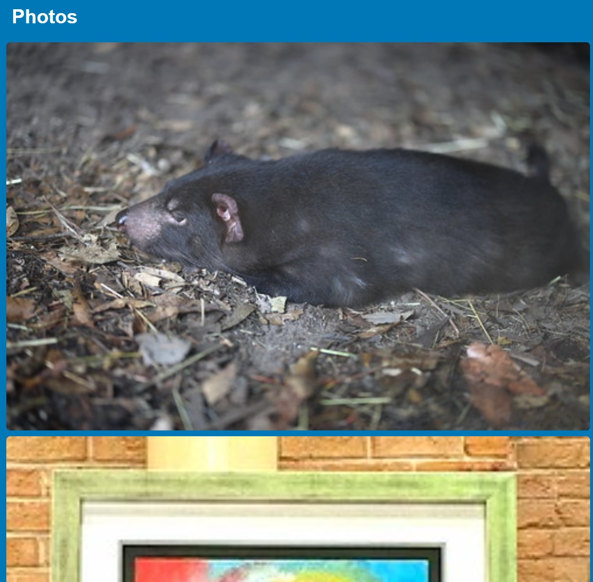

#Travel Explorer

The "Travel Explorer" project is a web application that allows users to search for tourist attractions and explore photos of various destinations. Users can enter the name of a destination and retrieve information about popular attractions, including their names, addresses, phone numbers, websites, and ratings. Additionally, the application fetches photos related to the destination using the Flickr API.

URL of deployed application: https://allenhirmiz.github.io/Travel-Explorer/

##User story:

As a user, I want to be able to enter the name of a city or travel destination in a search bar so that I can explore information about that location.
As a user, I want to see a list of popular attractions and landmarks in the chosen destination.
As a user, I want to read brief descriptions and ratings of the popular attractions.
As a user, I want to store my favorite travel destinations for quick access in the future.
As a user, I want to see a list of tourism info from economy tab in wikipedia
As a user, I want the application to be responsive and adapt to different screen sizes and devices.
As a user, I want to have a visually appealing and polished user interface with a clean layout.
As a user, I want to have a smooth and intuitive experience using modals for additional information and confirmation messages.

##Acceptance Criteria:

The homepage of the application prominently displays a search bar, allowing users to enter the name of a city or travel destination.
When a user enters a valid city or travel destination and submits the search, the application successfully retrieves relevant information about that location, including popular attractions, photos and ratings.
The displayed information for the searched location is clear, organised, and visually appealing, ensuring a positive user experience.

##Features

1. Search Form: The application provides a search form where users can enter the name of their desired destination. 

2. Popular Attractions: After submitting the search form, the application uses the Google Places API to fetch information about popular tourist attractions near the specified destination. It retrieves details such as attraction names, addresses, phone numbers, websites, and ratings. The information is displayed in a grid format, with each attraction represented by a card. 

3. Photos: The application integrates with the Flickr API to search for photos related to the destination. It retrieves a collection of photos and displays them in a separate section. Each photo is displayed in a card format. 

4. Map Display: The application utilizes the Google Maps JavaScript API to show a map of the specified destination. The map is centered on the location and displays markers for each attraction. Clicking on a marker opens an information window with the attraction's name.

5. Favourite Management: The application allows users to add destinations to their favorites list. When the user clicks the "Add to Favourite" button, the destination is added to the favorites section. The favorites list is stored in the browser's localStorage.

6. Select From Favourites: Users can view their favorite destinations by clicking the "Select From Favourites" button. This opens a modal that displays the list of saved favorites. Clicking on a favorite destination pre-fills the search form with the selected destination and initiates a search. 

7. Error Handling: The application includes error handling to display messages when there is no attraction data found or when there are issues with retrieving photos.

##Technologies Used

The project utilizes the following technologies:

- HTML: The structure and layout of the web page are defined using HTML.

- CSS: The styling and appearance of the web page are implemented using CSS, including the Foundation CSS framework for responsive design.

- JavaScript: The application's interactivity and functionality are implemented using JavaScript. The JavaScript code handles user input, communicates with APIs (Google Places, Flickr), and manipulates the DOM to display data.

- Google Maps JavaScript API: The API is used to display a map and markers for attractions.

- Google Places API: The API is used to fetch information about popular attractions near the specified destination.

- Flickr API: The API is used to search for and retrieve photos related to the destination.

##Usage
To use the application, follow these steps:

1. Open the web page in a modern web browser.

2. Enter the name of your desired destination in the search form.

3. Click the "Search" button to initiate the search.

4. The application will display information about popular attractions near the destination, including their names, addresses, phone numbers, websites, and ratings. Photos related to the destination will also be displayed.

5. You can click on the markers on the map to view the names of attractions in an information window.

6. To add the destination to your favorites list, click the "Add to Favourite" button.

7. To view your favorite destinations, click the "Select From Favourites" button. This will open a modal displaying your saved favorites. Clicking on a favorite destination will pre-fill the search form with the selected destination and initiate a search.

##Limitations and Future Improvements

- The application currently fetches only the top 5 attractions near the specified destination.

In the future, the number of attractions displayed could be made configurable or increased based on user preferences.

- The application relies on external APIs (Google Places, Flickr) for data retrieval. If there are issues with these APIs or the user's internet connection, it may impact the application's functionality.

- The application stores favorite destinations in the browser's localStorage, which has a limited storage capacity. In the future, a server-side storage solution could be implemented for improved scalability.

- The application could incorporate additional features such as user reviews and the ability to filter attractions based on specific criteria (e.g., distance from user’s location, etc.).

- The application could provide options to sort attractions by popularity, distance, or other factors to enhance user experience and exploration.

- The UI/UX could be further improved with better visual design and responsiveness across different devices.

Overall, the "Travel Explorer" application provides a convenient way for users to search and explore popular attractions in various travel destinations, along with associated photos. It offers an interactive and visually appealing experience for travelers to discover new places and plan their itineraries.
